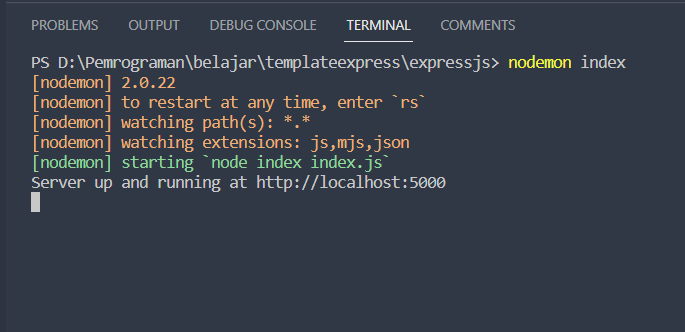
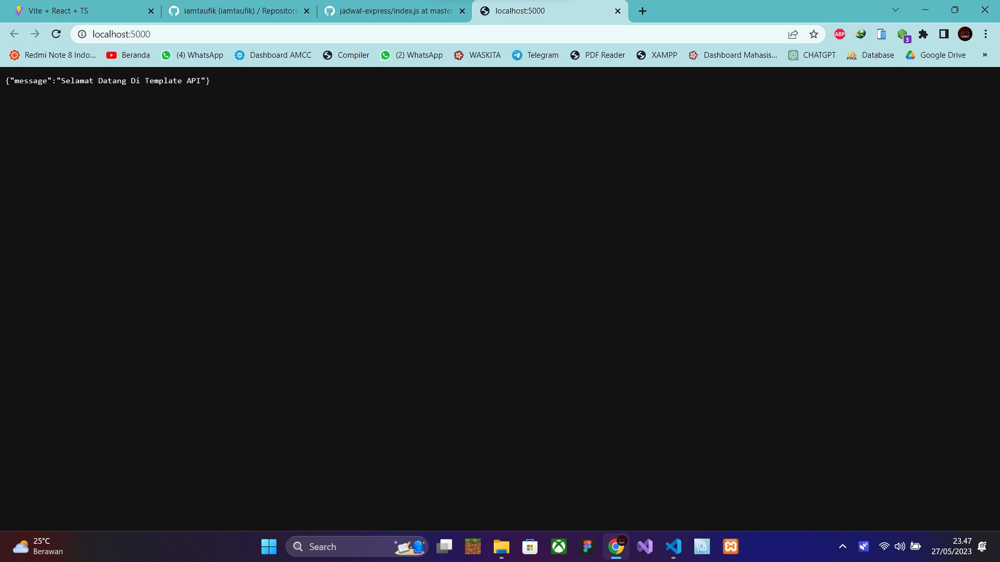

# Template-Express-API

Step Installation:

1. Clone repository

   `git clone https://github.com/irvanshandika/Template-Express-API.git`
2. Install nodemon for run the api localhost, port default: 5000

   - For local storage:
     `npm i nodemon`
   - For global:
     `npm i -g nodemon`
3. Then try run with nodemon

   `nodemon index`
4. it runs correctly, the output results are as in the screenshot below:

   
5. Then open your browser like chrome, edge, mozila, etc. :
   [localhost:5000](localhost:5000)

   
6. Congrats, you can make your controller and routes for your project

For prisma:

- First make the table if in your database didn't has, the type format "model" make you can see in /prisma/schema.prisma
  or you can click this [LINK](https://www.prisma.io/docs/getting-started/setup-prisma/start-from-scratch/relational-databases/using-prisma-migrate-node-planetscale)
- If you has already the database, you can:
  `prisma db pull`
- Then generate the database with CLI `prisma generate`

Dont forget to follow my social media:

[LinkedIn](https://www.linkedin.com/in/muhammad-irvan-shandika-b08a54273/)

[Facebook](https://www.facebook.com/shandika.irvan)

[Instagram](https://www.instagram.com/irvan_shandika/)

[Portfolio](https://irvanshandika.my.id)
